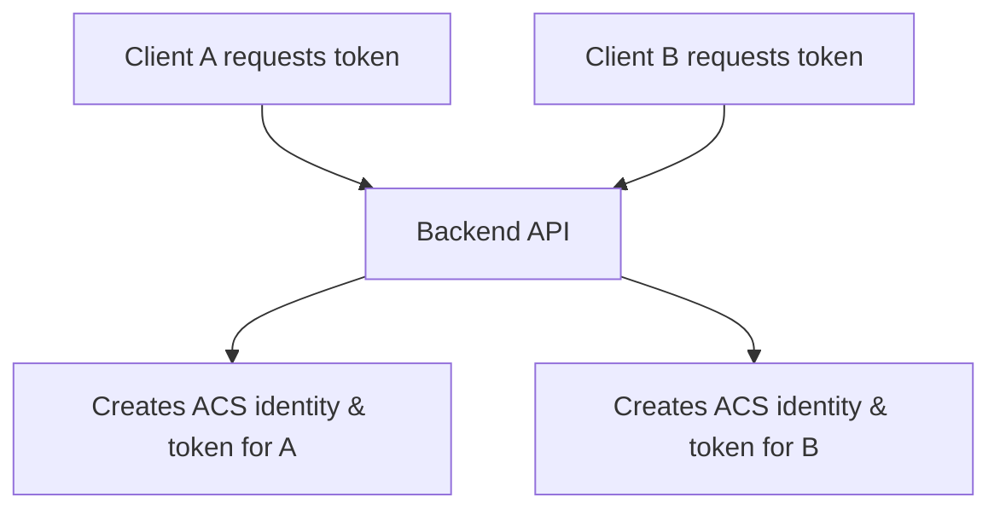

### Step1: Creating Identity and Access Token

 
 

```mermaid

graph TD
    A1[Client A requests token] --> B[Backend API]
    B --> A2[Creates ACS identity & token for A]
    C1[Client B requests token] --> B
    B --> C2[Creates ACS identity & token for B]

```